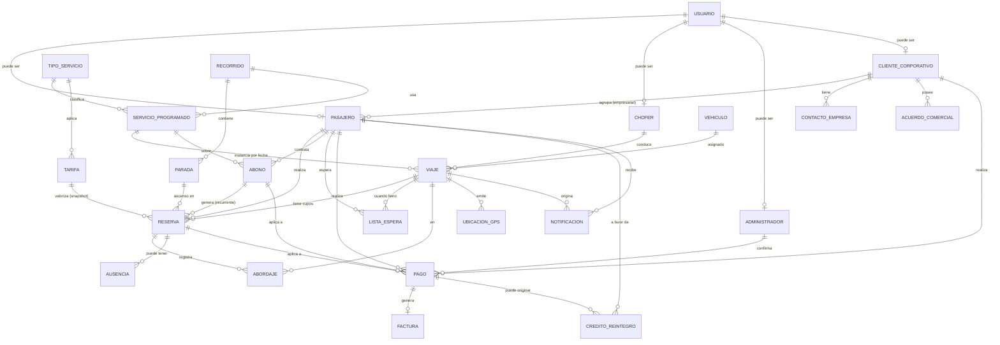

# Modelo de datos (DER) — Vanfull · v0.1 (BORRADOR PROVISIONAL)

> **⚠ El DER oficial lo produce el Integrante 2 (análisis) y lo pasa.** Este documento es un **borrador
> provisional** para no frenar el trabajo de backend; cuando llegue el DER oficial, se **concilia/reemplaza**
> (comparar entidades, atributos y relaciones; ajustar los modelos ORM a la versión oficial).
>
> **Estado:** PROPUESTA DE IA / borrador. Derivado con trazabilidad de los
> 45 RF y 31 RN aprobados (31/08/2026) y del AS-IS. **Nada acá es definitivo** hasta revisión del equipo.
> Motor destino: **PostgreSQL**. Convención: `snake_case`, PK `id` (bigint/uuid a decidir), FK `<entidad>_id`.

## 1. Diagrama entidad-relación (Mermaid)

## 2. Diccionario de entidades (atributos clave + trazabilidad)

| Entidad | Atributos clave | Deriva de |
|---|---|---|
| **USUARIO** | email, password_hash, rol (dueño/admin/chofer/pasajero/corporativo), estado, ult_login | RF-045, RF-041 |
| **PASAJERO** | nombre, apellido, **dni** (uniq, no autoeditable), foto_dni_frente/dorso, direccion, telefono, email, tipo (universitario/laboral/eventual/empresarial), universidad, contacto_emergencia, foto_perfil, **estado** (habilitado/suspendido/baja), cliente_corporativo_id (nullable) | RF-001/002/003, RN-026, AS-IS §6.1 |
| **CLIENTE_CORPORATIVO** | razon_social, **cuit**, direccion, condiciones, modalidad_pago (cta_cte/factura_post) | RF-034, RN-014/028, AS-IS §6.2 |
| **CONTACTO_EMPRESA** | cliente_corporativo_id, nombre, apellido, dni, telefono, email, cargo | AS-IS §6.2 |
| **ACUERDO_COMERCIAL** | cliente_corporativo_id, descripcion, tipo, vigencia | RN-014 |
| **ADMINISTRADOR** | usuario_id, es_dueño (bool) | RF-041, RN-027 |
| **CHOFER** | nombre, apellido, dni, direccion, telefono, email, cuil, contacto_emergencia, licencia, licencia_venc, doc_habilitante, estado | RF-023/024/025, AS-IS §25 |
| **VEHICULO** | **patente** (uniq), marca, modelo, capacidad, disponibilidad, vtv_venc, seguro_venc, habilitacion, matafuego_venc, estado | RF-026, AS-IS §24 |
| **TIPO_SERVICIO** | nombre (universitario/laboral/ocasional/especial/turismo/empresa) | Alcance, AS-IS §4 |
| **RECORRIDO** | nombre, tipo_servicio_id, origen, destino, activo | RF-019, AS-IS §21 |
| **PARADA** | recorrido_id, nombre, orden, direccion, lat, lng, horario_estimado, comprometida (bool) | RF-019, RN-020/021 |
| **SERVICIO_PROGRAMADO** | tipo_servicio_id, recorrido_id, dias_semana, hora_salida, hora_regreso, vehiculo_habitual, chofer_habitual, vigencia | AS-IS §20/21 (charter estable) |
| **VIAJE** (instancia) | servicio_programado_id (nullable p/ ocasional/especial), recorrido_id, vehiculo_id, chofer_id, fecha, hora_salida, hora_regreso, origen, destino, capacidad, **estado** (programado/en_curso/finalizado/cancelado) | RF-017/018, AS-IS §20 |
| **RESERVA** | pasajero_id, viaje_id (nullable si abono), abono_id (nullable), parada_ascenso_id, sentido (ida/vuelta), **estado** (provisional/consolidada/lista_espera/cancelada), tarifa_id (snapshot), fecha_reserva | RF-005/006/043, RN-001/002/031 |
| **ABONO** | pasajero_id, servicio_programado_id, tipo (estudiante/laboral), modalidad (ida/vuelta/ida_vuelta), dias_semana, periodo (mes/año), estado, cupo_mantenido | RF-044, RN-003..009 |
| **LISTA_ESPERA** | pasajero_id, viaje_id/servicio_programado_id, fecha, posicion | RF-007, RN-001 |
| **ABORDAJE** | reserva_id, viaje_id, vehiculo_id, parada_id, timestamp, metodo (QR), **estado** (registrado/pendiente_sync/validado), origen_offline (bool) | RF-014/015, RN-023 |
| **AUSENCIA** | reserva_id, fecha, avisada (bool), libera_cupo (bool) | RF-016, RN-024/025 |
| **TARIFA** | tipo_servicio_id, tipo_pasajero, modalidad, dias, importe, medio_pago, vigencia_desde/hasta | RF-027/028, RN-010..014, cuadro tarifario |
| **PAGO** | pasajero_id/cliente_corporativo_id, reserva_id/abono_id (nullable), importe, medio_pago (efectivo/transf/billetera/cta_cte/mercadopago), tipo (total/parcial/seña), **estado** (registrado/confirmado/rechazado), fecha, comprobante_url, pagador_tercero, confirmado_por (admin), mp_payment_id | RF-009/011/012, RN-011/013/015/016 |
| **CREDITO_REINTEGRO** | pasajero_id, pago_origen_id, tipo (credito/devolucion/reintegro), importe, estado, vigencia_mes | RF-013, RN-017/018/019 |
| **FACTURA** | pago_id/cliente_id, tipo, numero, importe, fecha, pdf_url | RF-037 (⚠ pendiente fiscal EXT-001) |
| **UBICACION_GPS** | viaje_id, lat, lng, timestamp | RF-021/022, RN-030 |
| **NOTIFICACION** | destinatario (pasajero/cliente), tipo (confirmacion_reserva/pago/recordatorio/proximidad/demora/cambio_horario/cambio_vehiculo/cancelacion), canal (app/whatsapp), estado, fecha, viaje_id/reserva_id | RF-033 |

> **Deuda** y **disponibilidad de cupo** los modelo como **derivados** (vistas/consultas), no como tablas:
> deuda = tarifas aplicables − pagos confirmados (RN-006); cupo = capacidad − reservas consolidadas.
> Auditoría (TEC-006) se resolvería con tablas `_historial`/log, pendiente de decisión.

## 3. Decisiones de modelado abiertas (las que necesito discutir con vos/equipo)

1. **⭐ Recurrencia charter (la más importante):** un abono estudiantil/laboral ocupa cupo en *cada* viaje
   del `servicio_programado` para los días contratados. ¿Materializamos una `RESERVA` por cada viaje/día
   (más filas, consulta de cupo simple) o el `ABONO` "ocupa" el asiento y la reserva puntual sólo existe
   para ocasionales/especiales (menos filas, consulta de cupo más compleja)? Mi recomendación: **materializar
   reservas** por viaje — hace triviales el control de cupo (RN-001), el abordaje QR y los reportes.
2. **Tarifa como snapshot:** guardar `tarifa_id` **y** el importe congelado en la RESERVA/PAGO, para que
   RN-012 (cambio tarifario no afecta lo pagado) funcione sin recalcular históricos. Recomendado: sí.
3. **PK:** `bigint` autoincremental (simple) vs `uuid` (mejor para sync offline del QR y IDs no adivinables).
   Con el requisito de abordaje offline (RF-015), me inclino por **uuid** al menos en ABORDAJE.
4. **Deuda/cupo derivados vs materializados:** derivados es más correcto; si el rendimiento molesta,
   materializamos con triggers. Empezar derivado.
5. **Reserva ida y vuelta:** RN-031 permite 1 ida + 1 vuelta por día. ¿Una RESERVA con `sentido` por fila
   (2 filas) o una reserva con dos tramos? Recomiendo **una fila por sentido** (encaja con RN-031 como constraint).

## 4. Trazabilidad de cobertura (RF → entidades)

Los 45 RF quedan cubiertos por el modelo salvo los explícitamente diferidos: RF-020 (optimización de rutas —
lógica de servicio, no dato), RF-037 (facturación — pendiente fiscal), RF-029..032 (chatbot — opera sobre estas
mismas entidades vía tools, no agrega tablas salvo quizá `CONVERSACION`/`DERIVACION` si se quiere trazar el chat).
